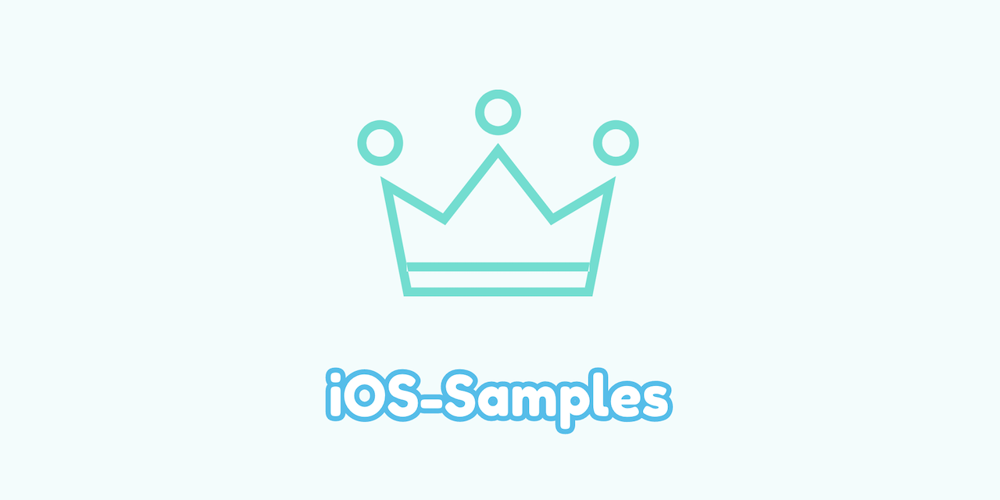

# iOS-Samples

  

💡 该存储库是通过 **Objective-C** 语言编写 iOS 应用程序的 Demo 集合。

💡 如果你发现我的 GitHub 仓库下很多之前的 repository 被删除了，你应该可以在这里面找到它们。

💡 本仓库下的 README 文档可能存在未及时更新的情况，如果有文档更新，一般会最先更新到我的 [简书账号](https://www.jianshu.com/u/84c5fadc7c18)下。

## Contents

### Foundation 框架

| Project Name | Description                            |
| ------------ | -------------------------------------- |
| NSURLSession | NSURLSession 示例 AFNetworking 示例 |

### UIKit 框架

| Project Name             | Description                                         |
| ------------------------ | --------------------------------------------------- |
| NavigationControllerDemo | UINavigationController 导航视图控制器使用示例       |
| UIAlertController        | UIAlertController 警告框                            |
| UICollectionView         | UICollectionViewController 集合视图控制器示例代码   |
| UIStackView              | UIStackView 堆栈视图示例代码                        |
| UIImageTips              | UIImage 使用示例，包括 SDWebImage 框架示例代码      |
| UIScrollView             | UIScrollView 使用示例                               |
| MathMonsters             | UISplitViewController 使用示例                      |
| UIPresentationController | UIPresentationController 自定义模态视图转场动画示例 |

### WebKit 框架

| Project Name  | Description                                                  |
| ------------- | ------------------------------------------------------------ |
| WKWebViewDemo | * WKWebView 的基础使用； * HTML 模版引擎 [GRMustache](https://github.com/groue/GRMustache) 的使用示例； * UITableView 与 WKWebView 混排的几个使用示例； |

### 数据库

| Project Name | Description |
| ------------ | ----------- |
|              |             |

### 视频照片二维码

| Project Name | Description                                                  |
| ------------ | ------------------------------------------------------------ |
| HQLCamera    | `UIImagePickerController`、`AVFoundation`、`PHPickerViewController` 使用示例 |

### 第三方开源框架

| Project Name | Description                                                  |
| ------------ | ------------------------------------------------------------ |
| MantleDemo   | Mantle—iOS 模型 & 字典转换框架                               |
| POPDemo      | [facebook/pop](https://github.com/facebook/pop) 动画示例     |
| KeychainDemo | 1.iOS 数据持久化方案 2. UUIDManager 3. SAMKeyChain 4. PINCahce |

### 其他 Demo 示例

| Project Name          | Description                                                  |
| --------------------- | ------------------------------------------------------------ |
| ReadMeLoginDemo       | iOS 实现 readme 登录页面的猫头鹰遮脸动画                     |
| ElectronicInvoiceDemo | 1. 集成 EAIntroView 框架显示启动引导页；  2. 创建轻量化 UITableView 的两种方式；  3. 登录页面，猫头鹰登录动画； |
| SignInWithApple       | 通过 Apple 登录的 Objective-C 实现示例代码；                 |

## Find Me

最后，如果你有非常重要的事想要找到我，你可以使用以下的任何一种方式：

* 我的邮箱：<andywhm@163.com>
* 我的博客：<https://andy0570.com>
* 简书：[独木舟的木](https://www.jianshu.com/u/84c5fadc7c18)

> Stay Hungry, Stay Foolish.

## Lincese

本项目基于 [MIT](https://opensource.org/licenses/MIT) 许可协议，详情请参见 [LICENSE](https://github.com/Andy0570/iOS-Samples/blob/master/LICENSE)。

