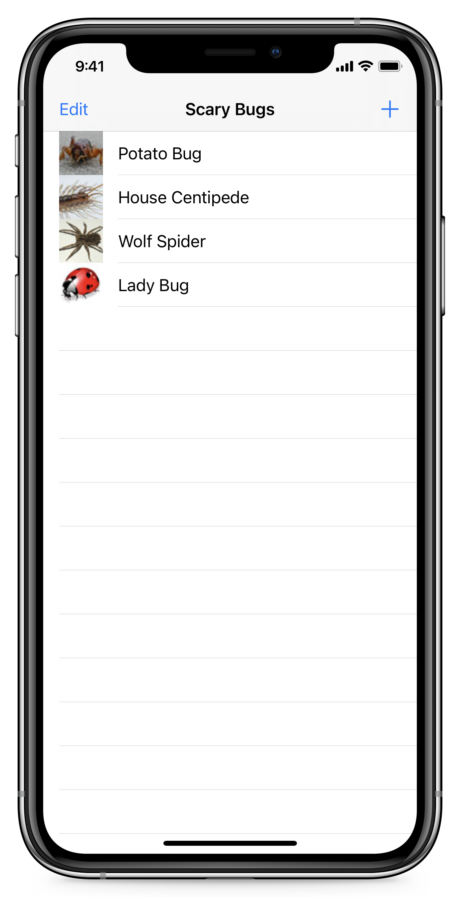
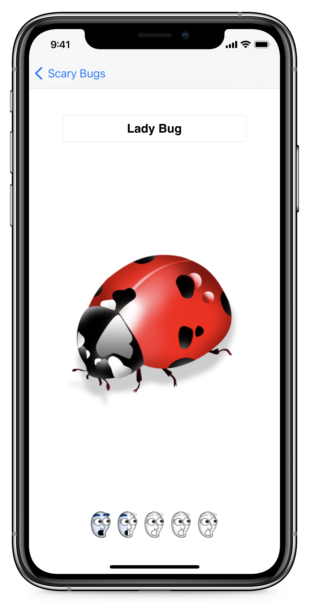

# ScaryBugs

> 为初学者提供的 iOS 教程，教你你如何从头开始制作你的第一个 iPhone 应用程序。


<p align="center">

</p>


##  原文

- [x] [iOS Tutorial: How To Create A Simple iPhone App Tutorial: Part 1/3](https://www.raywenderlich.com/1797/ios-tutorial-how-to-create-a-simple-iphone-app-part-1)
- [x] [iOS Tutorial: How To Create A Simple iPhone App Tutorial: Part 2/3](https://www.raywenderlich.com/1845/ios-tutorial-how-to-create-a-simple-iphone-app-tutorial-part-2)
- [x] [iOS Tutorial: How To Create A Simple iPhone App Tutorial: Part 3/3](https://www.raywenderlich.com/3112-ios-tutorial-how-to-create-a-simple-iphone-app-tutorial-part-3-3)
- [x] [UIView Tutorial for iOS: How To Make a Custom UIView in iOS 5: A 5 Star Rating View](https://www.raywenderlich.com/1768/uiview-tutorial-for-ios-how-to-make-a-custom-uiview-in-ios-5-a-5-star-rating-view)
- [x] [NSCoding Tutorial for iOS: How To Save Your App Data](https://www.raywenderlich.com/1914/nscoding-tutorial-for-ios-how-to-save-your-app-data)
* [Beginning Storyboards in iOS 5 Part 1](https://www.raywenderlich.com/3004-beginning-storyboards-in-ios-5-part-1)
* [Beginning Auto Layout Tutorial in iOS 7: Part 1](https://www.raywenderlich.com/2631-beginning-auto-layout-tutorial-in-ios-7-part-1)
* [Multithreading and Grand Central Dispatch on iOS for Beginners Tutorial](https://www.raywenderlich.com/3049-multithreading-and-grand-central-dispatch-on-ios-for-beginners-tutorial)
* [How To Use Blocks in iOS 5 Tutorial – Part 1](https://www.raywenderlich.com/2957-how-to-use-blocks-in-ios-5-tutorial-part-1)


##  知识点

 * `UISplitViewController`：主从列表视图控制器；
 * `UITableViewController`：列表性能优化（cell 的重用）、列表视图的编辑：添加、删除；
 * StroyBoard、拖拽添加 UI、关联对象、自动布局、Segues 的使用；
 * 常用控件的使用：`UITextField`、`UIButton`、`UIImageView`、`UILabel`；
 * 自定义评分视图：`XHRageView`；
 * 使用 `UIImagePickerController` 从相册中选择图片；
 * AppIcon 和 LaunchImage 的配置；
 * 使用第三方框架 [SVProgressHUD](https://github.com/SVProgressHUD/SVProgressHUD) 显示加载状态；
 * 通过 GCD 多线程编程处理耗时操作；
 * MVC 设计模式；
 * 基于 ~~`NSCoding`~~、`NSSecureCoding` 的持久化存储、图片文件的存取；


### UITableViewCell 的重用

```objc
- (UITableViewCell *)tableView:(UITableView *)tableView cellForRowAtIndexPath:(NSIndexPath *)indexPath
{
  UITableViewCell *cell = [tableView
               dequeueReusableCellWithIdentifier:@"MyBasicCell"];
  RWTScaryBugDoc *bug = [self.bugs objectAtIndex:indexPath.row];
  cell.textLabel.text = bug.data.title;
  cell.imageView.image = bug.thumbImage;
  return cell;
}
```

嗯，这是一个非常重要的性能优化点。请记住，列表视图可以包含非常多行，但每次只有一定数量的行内容显示在屏幕上。因此，操作系统不需要在每次新行循环滚动进入屏幕时都创建一个新的单元格，而是可以通过重用已经创建但现在已经被滚动到屏幕外的单元格来提高性能。


### 在 Storyboard 编辑器中显示 UI 元素的矩形边界

**Editor** —> **Canvas** —> **Show Bounds Rectangles**


### 视图控制器层级架构的调整

教程一里面的根视图控制器是 `UISplitViewController`:

```objc
- (void)scene:(UIScene *)scene willConnectToSession:(UISceneSession *)session options:(UISceneConnectionOptions *)connectionOptions {    
    if (@available(iOS 13.0, *)) {
        UISplitViewController *splitViewController = (UISplitViewController *)self.window.rootViewController;
        UINavigationController *navController = splitViewController.viewControllers.firstObject;
        MasterViewController *masterController = navController.viewControllers.firstObject;
        
        // 设置数据源
        RWTScaryBugDoc *bug1 = [[RWTScaryBugDoc alloc] initWithTitle:@"Potato Bug" rating:4 thumbImage:[UIImage imageNamed:@"potatoBugThumb.jpg"] fullImage:[UIImage imageNamed:@"potatoBug.jpg"]];
        RWTScaryBugDoc *bug2 = [[RWTScaryBugDoc alloc] initWithTitle:@"House Centipede" rating:3 thumbImage:[UIImage imageNamed:@"centipedeThumb.jpg"] fullImage:[UIImage imageNamed:@"centipede.jpg"]];
        RWTScaryBugDoc *bug3 = [[RWTScaryBugDoc alloc] initWithTitle:@"Wolf Spider" rating:5 thumbImage:[UIImage imageNamed:@"wolfSpiderThumb.jpg"] fullImage:[UIImage imageNamed:@"wolfSpider.jpg"]];
        RWTScaryBugDoc *bug4 = [[RWTScaryBugDoc alloc] initWithTitle:@"Lady Bug" rating:1 thumbImage:[UIImage imageNamed:@"ladybugThumb.jpg"] fullImage:[UIImage imageNamed:@"ladybug.jpg"]];
        NSMutableArray *bugs = [NSMutableArray arrayWithObjects:bug1, bug2, bug3, bug4, nil];
        masterController.bugs = bugs;
    }
}
```

跑到教程二里就自动变成了 `UINavigationController`，而且作者也没提：

```objc
- (void)scene:(UIScene *)scene willConnectToSession:(UISceneSession *)session options:(UISceneConnectionOptions *)connectionOptions {    
    if (@available(iOS 13.0, *)) {
        UINavigationController *navController = (UINavigationController *)self.window.rootViewController;
        MasterViewController *masterController = navController.viewControllers.firstObject;
        
        // 设置数据源
        RWTScaryBugDoc *bug1 = [[RWTScaryBugDoc alloc] initWithTitle:@"Potato Bug" rating:4 thumbImage:[UIImage imageNamed:@"potatoBugThumb.jpg"] fullImage:[UIImage imageNamed:@"potatoBug.jpg"]];
        RWTScaryBugDoc *bug2 = [[RWTScaryBugDoc alloc] initWithTitle:@"House Centipede" rating:3 thumbImage:[UIImage imageNamed:@"centipedeThumb.jpg"] fullImage:[UIImage imageNamed:@"centipede.jpg"]];
        RWTScaryBugDoc *bug3 = [[RWTScaryBugDoc alloc] initWithTitle:@"Wolf Spider" rating:5 thumbImage:[UIImage imageNamed:@"wolfSpiderThumb.jpg"] fullImage:[UIImage imageNamed:@"wolfSpider.jpg"]];
        RWTScaryBugDoc *bug4 = [[RWTScaryBugDoc alloc] initWithTitle:@"Lady Bug" rating:1 thumbImage:[UIImage imageNamed:@"ladybugThumb.jpg"] fullImage:[UIImage imageNamed:@"ladybug.jpg"]];
        NSMutableArray *bugs = [NSMutableArray arrayWithObjects:bug1, bug2, bug3, bug4, nil];
        masterController.bugs = bugs;
    }
}
```

在教程二中，视图控制器的层级架构被调整为：

```
UINavigationController - MasterViewController - DetailViewController
```

不这么调整的话，`MasterViewController` 中的：

```objc
// 当用户进入 detailViewController 更新数据并返回，刷新本列表视图以同步显示数据
- (void)didMoveToParentViewController:(UIViewController *)parent {
    [self.tableView reloadData];
}
```

方法不会被调用，导致更新数据模型后，返回不会刷新。

### Core Data

```objc
// 创建 Core Data  堆栈
// #1 数据模型的结构信息
@property (nonatomic, strong, readwrite) NSManagedObjectModel *managedObjectModel;
// #2 数据持久层和对象模型协调器
@property (nonatomic, strong, readwrite) NSPersistentStoreCoordinator *persistentStoreCoordinator;
// #3 对象的上下文 managedObject 模型
@property (nonatomic, strong, readwrite) NSManagedObjectContext *context;
```

测试用例：

```objc
- (void)coreDataTestMethod {
    
    //------------⭐️⭐️⭐️Core Data 添加数据⭐️⭐️⭐️----------------------
    // 1.获取 NSManagedObjectContext 上下文对象
    context = [AppDelegate new].context;
    
    // 2.使用 NSEntityDescription 创建 NSManagedObject 对象
    Person *person = [NSEntityDescription insertNewObjectForEntityForName:@"Person" inManagedObjectContext:context];
    person.name = @"Jack";
    person.age = 17;
    
    // 3.使用 NSManagedObjectContext 上下文对象保存 NSManagedObject 数据到 SQLite 数据库
    NSError *error;
    [context save:&error];
    
    //------------⭐️⭐️⭐️Core Data 查询数据⭐️⭐️⭐️----------------------
    /*
     
     Core Data 从数据库中查询数据，会用到三个类
     * NSFetchRequest:一条查询请求，相当于 SQL 中的 select 语句
     * NSPredicate:谓词，指定一些查询条件，相当于 SQL 中的 where 语句
     * NSSortDescriptor:指定排序规则，相当于 SQL 中的 order by
     
     ## NSFetchRequest
     属性 predicate ：是 NSPredicate 对象
     属性 sortDescriptors：是一个 NSSortDescriptor 数组，数组中前面的优先级比后面高。可以有多个排列规则
     
     其他属性：
     fetchLimit：结果集最大数，相当于 SQL 中的 limit
     fetchOffset：查询的偏移量，默认为0
     fetchBatchSize：分批处理查询的大小，查询分批返回结果集
     entityName/entity：数据表名，相当于 SQL 中的 from
     propertiesToGroupBy：分组规则，相当于 SQL 中的 group by
     propertiesToFetch：定义要查询的字段，默认查询全部字段
     
     设置好 NSFetchRequest 之后，调用 NSManagedObjectContext 上下文的 executeFetchRequest 方法执行查询请求，就会返回结果集
     
     */
    
    // Xcode 自动创建的 NSManagedObject 会生成 fetchRequest 方法，可以直接得到 NSFetchRequest
    NSFetchRequest *fetchRequest = [Person fetchRequest];
    
    // 也可以这样：直接查询实体名
    // [NSFetchRequest fetchRequestWithEntityName:@"Person"];
    
    // 使用谓词
    fetchRequest.predicate = [NSPredicate predicateWithFormat:@"age == %@",@(18)];
    
    // 排序:按升序排序
    NSArray<NSSortDescriptor *> *sortDescriptor = @[[NSSortDescriptor sortDescriptorWithKey:@"age" ascending:YES]];
    fetchRequest.sortDescriptors = sortDescriptor;
    
    // 使用 executeFetchRequest 方法得到结果集
    NSArray<Person *> *personResult = [context executeRequest:fetchRequest error:nil];
    
    
    // snippet:fetch
    /*
    // 指定要查询的实体
    NSFetchRequest *fetchRequest = [[NSFetchRequest alloc] init];
    NSEntityDescription *entity = [NSEntityDescription entityForName:@"<#Entity name#>" inManagedObjectContext:<#context#>];
    [fetchRequest setEntity:entity];
     
    // 指定筛选要提取对象的条件
    NSPredicate *predicate = [NSPredicate predicateWithFormat:@"<#format string#>", <#arguments#>];
    [fetchRequest setPredicate:predicate];
     
    // 指定如何对抓取的对象进行排序
    NSSortDescriptor *sortDescriptor = [[NSSortDescriptor alloc] initWithKey:@"<#key#>"
                                                                   ascending:YES];
    [fetchRequest setSortDescriptors:[NSArray arrayWithObjects:sortDescriptor, nil]];
    
    // 执行查询方法
    NSError *error = nil;
    NSArray *fetchedObjects = [<#context#> executeFetchRequest:fetchRequest error:&error];
    if (fetchedObjects == nil) {
        <#Error handling code#>
    }
     */
    
    
    //------------⭐️⭐️⭐️Core Data 更改数据⭐️⭐️⭐️----------------------
    // 查询出要修改的数据后，直接修改值，然后用 context save 保存
    for (Person *person in personResult) {
        person.age = 23;
    }
    // 使用 NSManagedObjectContext 上下文保存修改结果
    [context save:&error];
    
    
    //------------⭐️⭐️⭐️Core Data 删除数据⭐️⭐️⭐️----------------------
    // 查询出来要删除的数据后，调用 NSManagedObjectContext 上下文的 deleteObject 方法删除数据
    for (Person *person in personResult) {
        // 删除数据
        if (person.age == 23) {
            [context deleteObject:person];
        }
    }
    // 使用 NSManagedObjectContext 上下文保存修改结果
    [context save:&error];
}
```
